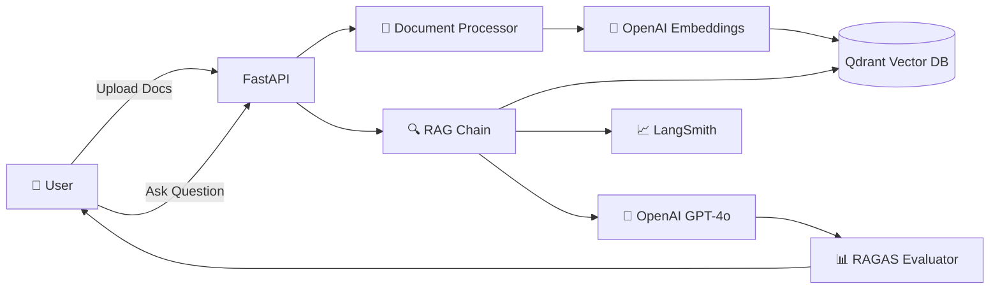

<div align="center">

# 🤖 RAG Q&A System

### Production-Ready Retrieval-Augmented Generation with FastAPI & LangChain

[](https://www.python.org/downloads/)
[](https://fastapi.tiangolo.com)
[](https://python.langchain.com)
[](LICENSE)
[](https://github.com/features/actions)
[](https://www.docker.com/)
[](https://aws.amazon.com/apprunner/)

[Features](#-features) •
[Quick Start](#-quick-start) •
[API Docs](#-api-endpoints) •
[Deployment](#-deployment) •
[Contributing](#-contributing)


</div>

---

## 📖 Overview

A **production-ready** RAG (Retrieval-Augmented Generation) system that enables intelligent Q&A over your documents. Built with modern AI stack and battle-tested in production environments.

### 🎯 What is RAG?

RAG combines the power of **retrieval** (finding relevant information) with **generation** (creating coherent answers) to provide accurate, context-aware responses to your questions based on your own documents.

### 🌟 Key Highlights

- 🚀 **Production Ready**: Docker + CI/CD + AWS deployment
- 🧠 **Smart AI**: Powered by OpenAI GPT-4o & LangChain
- 📊 **Observable**: LangSmith integration for full tracing
- ✅ **Evaluated**: RAGAS metrics for answer quality
- 🔒 **Secure**: Non-root Docker, API validation, error handling
- ⚡ **Fast**: Async operations, streaming responses
- 📈 **Scalable**: Cloud-native architecture

---

## ✨ Features

### 📄 Document Management
- ✅ Upload **PDF**, **TXT**, and **CSV** files
- ✅ Automatic text extraction and chunking
- ✅ Smart document splitting with overlap
- ✅ Vector storage in Qdrant Cloud

### 💬 Intelligent Q&A
- ✅ Natural language questions
- ✅ Context-aware answers
- ✅ Source attribution (see which docs were used)
- ✅ Streaming responses for real-time feedback
- ✅ Multiple query modes (standard, search-only)

### 🔍 Observability & Quality
- ✅ **LangSmith Tracing**: Full chain visibility, token tracking, cost analysis
- ✅ **RAGAS Evaluation**: Faithfulness & answer relevancy metrics
- ✅ **Structured Logging**: Comprehensive error tracking
- ✅ **Health Checks**: Readiness & liveness endpoints

### 🛠️ Developer Experience
- ✅ **Auto-generated Swagger docs** at `/docs`
- ✅ **Type-safe** Pydantic models
- ✅ **Comprehensive tests** with 70%+ coverage
- ✅ **Hot reload** in development
- ✅ **CI/CD pipeline** with GitHub Actions

---

## 🏗️ Architecture



### Tech Stack

| Component | Technology | Purpose |
|-----------|------------|---------|
| 🐍 Language | **Python 3.12** | Modern Python with type hints |
| 🚀 API Framework | **FastAPI** | High-performance async API |
| 🧠 RAG Framework | **LangChain** | LLM orchestration |
| 🗄️ Vector DB | **Qdrant Cloud** | Semantic search |
| 🔢 Embeddings | **text-embedding-3-small** | Document encoding |
| 🤖 LLM | **GPT-4o-mini** | Answer generation |
| 📊 Evaluation | **RAGAS** | Quality metrics |
| 🔍 Observability | **LangSmith** | Tracing & monitoring |
| 🐳 Container | **Docker** | Containerization |
| ☁️ Cloud | **AWS App Runner** | Serverless hosting |
| 🔄 CI/CD | **GitHub Actions** | Automated pipeline |

---

## 🚀 Quick Start

### Prerequisites

- 🐍 Python 3.12+
- 🔑 OpenAI API key ([Get one](https://platform.openai.com/api-keys))
- 🗄️ Qdrant Cloud account ([Sign up](https://cloud.qdrant.io))

### 1️⃣ Clone & Install

```bash
# Clone repository
git clone https://github.com/yourusername/rag-qa-project.git
cd rag-qa-project

# Install with UV (recommended)
uv sync

# Or with pip
pip install -r requirements.txt
```

### 2️⃣ Configure Environment

```bash
# Copy environment template
cp .env.example .env

# Edit with your credentials
nano .env
```

**Required variables:**
```bash
OPENAI_API_KEY=sk-proj-your-key-here
QDRANT_URL=https://your-cluster.qdrant.io
QDRANT_API_KEY=your-qdrant-api-key
```

**Optional - LangSmith Observability:**
```bash
LANGCHAIN_TRACING_V2=true
LANGCHAIN_API_KEY=lsv2_pt_your-key-here
LANGCHAIN_PROJECT=rag-qa-production
```

### 3️⃣ Run Application

```bash
# Development mode with hot reload
uvicorn app.main:app --reload

# Or using Python
python -m app.main
```

### 4️⃣ Access API

🌐 **Swagger UI**: http://localhost:8000/docs
📚 **ReDoc**: http://localhost:8000/redoc
🔍 **Health Check**: http://localhost:8000/health

---

## 📝 API Endpoints

### Document Management

| Endpoint | Method | Description | Example |
|----------|--------|-------------|---------|
| 📤 `/documents/upload` | POST | Upload document | [See below](#upload-document) |
| ℹ️ `/documents/info` | GET | Get collection stats | `curl /documents/info` |
| 🗑️ `/documents/collection` | DELETE | Delete all documents | `curl -X DELETE /documents/collection` |

### Query & Search

| Endpoint | Method | Description | Features |
|----------|--------|-------------|----------|
| 💬 `/query` | POST | Ask a question | Sources, Evaluation |
| 🌊 `/query/stream` | POST | Streaming response | Real-time tokens |
| 🔍 `/query/search` | POST | Search only | No generation |

### Health & Monitoring

| Endpoint | Method | Description |
|----------|--------|-------------|
| ❤️ `/health` | GET | Basic health check |
| ✅ `/health/ready` | GET | Readiness with DB status |

---

## 💡 Usage Examples

### Upload a Document

```bash
curl -X POST "http://localhost:8000/documents/upload" \
  -H "Content-Type: multipart/form-data" \
  -F "file=@research_paper.pdf"
```

**Response:**
```json
{
  "message": "Document uploaded and processed successfully",
  "filename": "research_paper.pdf",
  "chunks_created": 42,
  "document_ids": ["uuid-1", "uuid-2", ...]
}
```

### Ask a Question

```bash
curl -X POST "http://localhost:8000/query" \
  -H "Content-Type: application/json" \
  -d '{
    "question": "What is the main contribution of this paper?",
    "include_sources": true,
    "enable_evaluation": false
  }'
```

**Response:**
```json
{
  "question": "What is the main contribution of this paper?",
  "answer": "The main contribution is...",
  "sources": [
    {
      "content": "Excerpt from page 3...",
      "metadata": {"source": "research_paper.pdf", "page": 3}
    }
  ],
  "processing_time_ms": 1234.5
}
```

### Query with RAGAS Evaluation

```bash
curl -X POST "http://localhost:8000/query" \
  -H "Content-Type: application/json" \
  -d '{
    "question": "Summarize the methodology",
    "include_sources": true,
    "enable_evaluation": true
  }'
```

**Response includes evaluation scores:**
```json
{
  "question": "Summarize the methodology",
  "answer": "The methodology involves...",
  "sources": [...],
  "processing_time_ms": 3456.7,
  "evaluation": {
    "faithfulness": 0.95,
    "answer_relevancy": 0.87,
    "evaluation_time_ms": 1200.5,
    "error": null
  }
}
```

---

## 🐳 Docker Deployment

### Using Docker Compose (Recommended)

```bash
# Build and run
docker-compose up --build

# Run in detached mode
docker-compose up -d

# View logs
docker-compose logs -f app

# Stop
docker-compose down
```

### Using Docker Directly

```bash
# Build image
docker build -t rag-qa-system .

# Run container
docker run -p 8000:8000 --env-file .env rag-qa-system

# Run with custom port
docker run -p 3000:8000 --env-file .env rag-qa-system
```

---

## ☁️ Deployment

### AWS App Runner (Serverless)

Fully automated deployment with GitHub Actions:

1️⃣ **Setup AWS Resources**
```bash
# Create ECR repository
aws ecr create-repository --repository-name rag-qa-system --region us-east-1

# Create IAM role for App Runner
aws iam create-role --role-name AppRunnerECRAccessRole --assume-role-policy-document file://trust-policy.json
```

2️⃣ **Configure GitHub Secrets**

Add these secrets in: `Settings → Secrets and variables → Actions`

- `AWS_ACCESS_KEY_ID`
- `AWS_SECRET_ACCESS_KEY`
- `APP_RUNNER_ECR_ACCESS_ROLE_ARN`
- `OPENAI_API_KEY`
- `QDRANT_URL`
- `QDRANT_API_KEY`
- `LANGCHAIN_API_KEY` (optional)

3️⃣ **Deploy**

```bash
# Push to main branch
git push origin main

# GitHub Actions automatically:
# ✅ Runs tests
# ✅ Builds Docker image
# ✅ Pushes to ECR
# ✅ Deploys to App Runner
```

4️⃣ **Access Your API**

Your app will be available at: `https://xxxxx.us-east-1.awsapprunner.com`

📖 **Full Guide**: See [AWS Deployment Guide](docs/AWS_DEPLOYMENT_GUIDE.md)

---

## 🧪 Testing

### Run All Tests

```bash
# Install dev dependencies
uv sync --extra dev

# Run tests with coverage
pytest --cov=app --cov-report=html

# View coverage report
open htmlcov/index.html
```

### Run Specific Tests

```bash
# Test query endpoints
pytest tests/test_query.py -v

# Test RAG chain
pytest tests/test_rag_chain.py -v

# Test RAGAS evaluator
pytest tests/test_ragas_evaluator.py -v
```

### Code Quality

```bash
# Format code
uv run black app/ tests/

# Lint code
uv run ruff check app/ tests/

# Fix linting issues
uv run ruff check app/ tests/ --fix

# Type checking
uv run mypy app/
```

---

## ⚙️ Configuration

### Environment Variables

| Variable | Default | Description |
|----------|---------|-------------|
| **Required** |||
| `OPENAI_API_KEY` | - | OpenAI API key |
| `QDRANT_URL` | - | Qdrant Cloud URL |
| `QDRANT_API_KEY` | - | Qdrant API key |
| **Document Processing** |||
| `COLLECTION_NAME` | `rag_documents` | Vector collection name |
| `CHUNK_SIZE` | `1000` | Text chunk size |
| `CHUNK_OVERLAP` | `200` | Chunk overlap tokens |
| **AI Models** |||
| `EMBEDDING_MODEL` | `text-embedding-3-small` | OpenAI embedding model |
| `LLM_MODEL` | `gpt-4o-mini` | OpenAI chat model |
| `LLM_TEMPERATURE` | `0.0` | LLM temperature (0-2) |
| **RAGAS Evaluation** |||
| `RAGAS_LLM_MODEL` | (uses `LLM_MODEL`) | Model for evaluation |
| `RAGAS_TIMEOUT_SECONDS` | `30.0` | Evaluation timeout |
| **LangSmith Observability** |||
| `LANGCHAIN_TRACING_V2` | `false` | Enable LangSmith tracing |
| `LANGCHAIN_API_KEY` | - | LangSmith API key |
| `LANGCHAIN_PROJECT` | `rag-qa-production` | Project name |
| **API Settings** |||
| `API_HOST` | `0.0.0.0` | API host |
| `API_PORT` | `8000` | API port |
| `LOG_LEVEL` | `INFO` | Logging level |

---

## 📊 Project Structure

```
rag-qa-project/
├── 📁 app/                      # Application code
│   ├── main.py                  # FastAPI app entry
│   ├── config.py                # Configuration
│   ├── 📁 api/
│   │   ├── 📁 routes/           # API endpoints
│   │   │   ├── health.py        # Health checks
│   │   │   ├── documents.py     # Document management
│   │   │   └── query.py         # Q&A endpoints
│   │   └── schemas.py           # Pydantic models
│   ├── 📁 core/                 # Business logic
│   │   ├── document_processor.py # Doc loading & chunking
│   │   ├── embeddings.py        # Embedding service
│   │   ├── vector_store.py      # Qdrant operations
│   │   ├── rag_chain.py         # RAG orchestration
│   │   └── ragas_evaluator.py   # Quality evaluation
│   └── 📁 utils/
│       └── logger.py            # Logging setup
├── 📁 tests/                    # Test suite
│   ├── conftest.py              # Pytest fixtures
│   ├── test_query.py            # API tests
│   ├── test_rag_chain.py        # RAG tests
│   └── test_ragas_evaluator.py  # Evaluation tests
├── 📁 .github/workflows/        # CI/CD pipelines
│   ├── ci.yml                   # Continuous Integration
│   └── deploy.yml               # Deployment to AWS
├── 📁 docs/                     # Documentation
│   └── AWS_DEPLOYMENT_GUIDE.md  # AWS setup guide
├── Dockerfile                   # Production container
├── docker-compose.yml           # Local development
├── pyproject.toml               # Project config (UV)
├── requirements.txt             # Python dependencies
├── requirements-dev.txt         # Dev dependencies
├── .env.example                 # Environment template
├── CLAUDE.md                    # Project instructions
└── README.md                    # This file
```

---

## 🔄 CI/CD Pipeline

### Continuous Integration (`.github/workflows/ci.yml`)

Runs on every push and pull request:

1. ✅ **Code Quality**
   - Ruff linting
   - Black formatting check

2. ✅ **Testing**
   - Unit tests with pytest
   - 70%+ code coverage required
   - Coverage reports uploaded

3. ✅ **Docker Build**
   - Multi-stage build
   - Image size optimization
   - Container health check

4. ✅ **Security**
   - Bandit security scan
   - Dependency vulnerability check (Safety)

### Continuous Deployment (`.github/workflows/deploy.yml`)

Deploys to AWS on push to `main`:

1. 🏗️ **Build & Push**
   - Build Docker image
   - Tag with commit SHA + latest
   - Push to AWS ECR

2. 🚀 **Deploy**
   - Update App Runner service
   - Zero-downtime deployment
   - Auto-rollback on failure

3. ✅ **Verify**
   - Health check
   - Smoke tests

---

## 🤝 Contributing

We welcome contributions! Here's how you can help:

### 🐛 Report Bugs

Found a bug? [Open an issue](https://github.com/yourusername/rag-qa-project/issues) with:
- Clear description
- Steps to reproduce
- Expected vs actual behavior
- Environment details

### 💡 Suggest Features

Have an idea? [Create a feature request](https://github.com/yourusername/rag-qa-project/issues/new) with:
- Use case description
- Proposed solution
- Alternative approaches considered

### 🔧 Submit Pull Requests

1. Fork the repository
2. Create a feature branch (`git checkout -b feature/amazing-feature`)
3. Make your changes
4. Add tests for new functionality
5. Ensure all tests pass (`pytest`)
6. Format code (`black app/ tests/`)
7. Lint code (`ruff check app/ tests/`)
8. Commit changes (`git commit -m 'Add amazing feature'`)
9. Push to branch (`git push origin feature/amazing-feature`)
10. Open a Pull Request

### 📜 Development Guidelines

- ✅ Write tests for new features
- ✅ Maintain >70% code coverage
- ✅ Follow PEP 8 style guide
- ✅ Add docstrings to functions
- ✅ Update documentation
- ✅ Keep commits atomic and descriptive

---

## 📚 Additional Resources

### Documentation
- 📖 [FastAPI Docs](https://fastapi.tiangolo.com/)
- 🦜 [LangChain Docs](https://python.langchain.com/)
- 🗄️ [Qdrant Docs](https://qdrant.tech/documentation/)
- 🤖 [OpenAI API Docs](https://platform.openai.com/docs)
- 📊 [RAGAS Docs](https://docs.ragas.io/)
- 🔍 [LangSmith Docs](https://docs.smith.langchain.com/)

### Tutorials & Guides
- 🎓 [Building Production RAG Systems](https://www.anthropic.com/research/building-rag-systems)
- 🚀 [FastAPI Best Practices](https://github.com/zhanymkanov/fastapi-best-practices)
- 🐳 [Docker Best Practices](https://docs.docker.com/develop/dev-best-practices/)

---

## 📄 License

This project is licensed under the **MIT License** - see the [LICENSE](LICENSE) file for details.

```
MIT License

Copyright (c) 2025 RAG Q&A System Contributors

Permission is hereby granted, free of charge, to any person obtaining a copy
of this software and associated documentation files (the "Software"), to deal
in the Software without restriction, including without limitation the rights
to use, copy, modify, merge, publish, distribute, sublicense, and/or sell
copies of the Software, and to permit persons to whom the Software is
furnished to do so, subject to the following conditions:

The above copyright notice and this permission notice shall be included in all
copies or substantial portions of the Software.
```

---

## 🙏 Acknowledgments

Built with amazing open-source tools:

- 🚀 [FastAPI](https://fastapi.tiangolo.com/) - Modern web framework
- 🦜 [LangChain](https://python.langchain.com/) - LLM framework
- 🗄️ [Qdrant](https://qdrant.tech/) - Vector database
- 🤖 [OpenAI](https://openai.com/) - AI models
- 🐳 [Docker](https://www.docker.com/) - Containerization
- ☁️ [AWS](https://aws.amazon.com/) - Cloud infrastructure
- 📊 [RAGAS](https://docs.ragas.io/) - RAG evaluation
- 🔍 [LangSmith](https://smith.langchain.com/) - Observability

Special thanks to all [contributors](https://github.com/yourusername/rag-qa-project/graphs/contributors)!

---

## 💬 Support

- 📧 **Email**: your.email@example.com
- 💬 **Issues**: [GitHub Issues](https://github.com/yourusername/rag-qa-project/issues)
- 📖 **Documentation**: [Wiki](https://github.com/yourusername/rag-qa-project/wiki)
- 🐦 **Twitter**: [@yourhandle](https://twitter.com/yourhandle)

---

<div align="center">

### ⭐ Star this repo if you find it helpful!

**Made with ❤️ by the RAG Q&A Team**

[Report Bug](https://github.com/yourusername/rag-qa-project/issues) •
[Request Feature](https://github.com/yourusername/rag-qa-project/issues) •
[Contribute](CONTRIBUTING.md)

</div>
"# rag_qa_project" 
